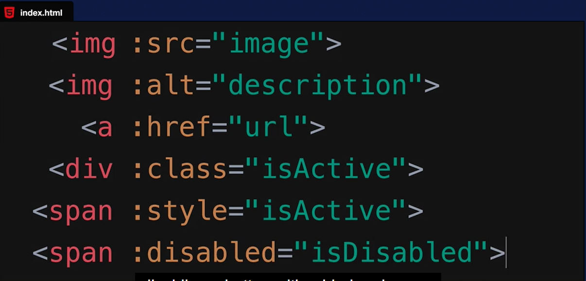

# introducción a vue JS

## mediante un proyecto de la manera más simple de utilizarlo en uno.

## agregando su CDN dentro de head(tag) AQUI head(tag)

```c
<script src="https://unpkg.com/vue@3"></script>
```


## dentro de la instancia Vue (objeto) configuramos nuestra aplicación

## Challenge 1

- Añadir descripción de un producto al objeto `data`.
- Mostrar la descripción en una TAG "p"

[HECHO]

## v-bind USES



## Challenge 2

- añadir un URL al objeto `data`
- usando v-bind para linkear con el atributo `href`

[HECHO]

## Challenge 3

- añadir Booleano al objeto `data`
- Que muestre una etiqueta de oferta cuando haya una (onSale == true)
